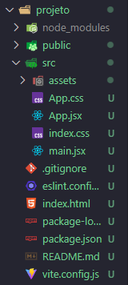

# Este é o README do vídeo do "Curso de React para completos iniciantes" do Felipe Rocha

Vídeo do curso está disponível no [canal do YouTube do Felipe Rocha](https://youtu.be/2RWsLmu8yVc?si=n8V7t1yarrNJd3ZF)

---
# [Processo de criação do "Gerenciador de Tarefas"](#projeto-gerenciador-de-tarefas)

### O que é o react?

* O React é uma biblioteca usada para criar interfaces de usuário interativas.

### Componentes

* No React, uma aplicação é dividida em pequenos componentes. Quando vários desses componentes são combinados, formam grandes estruturas.

## Primeiro Código em React

Para iniciar a criação de um projeto, vai ser utilizada a ferramenta `Vite`, que facilita na criação de um projeto react.

Para a instalação do vite, basta no terminal, usar o comando:

```
npm create vite@5.5.2 .
```

Após o comando, será criada a seguinte estrutura de projeto:



### SPA (Single Page Application)

* O **SPA** é uma página **html** que atualiza dinâmicamente o conteúdo conforme o usuário interage com a aplicação, sem a necessidade de recarregar a página inteira. Um **SPA** carrega uma única página e atualiza somente as partes necessárias da interface com o JavaScript.

### State (Estado)

O **State** é um objeto JavaScript que armazena dados dinâmicos em um componente. Esses dados podem mudar durante o ciclo de vida do componente, como por exemplo, resposta a interações do usuário, cliques ou atualizações de dados vindos de uma **API**. Quando um estado muda, o **React** re-renderiza o componente para refletir as novas informações na interface.

Para usar o state, primeiro temos que importar o hook `useState`:

```js
import { useState } from 'react'
```

Depois, criar a variável de estado:

```js
const [state, setState] = useState(valorInicial);
```

✴️ `state` ➜ Variável que armazena o valor atual do estado

✴️ `setState` ➜ Função usada para atualizar o estado

✴️ `valorInicial` ➜ Valor inicial do estado

**Exemplo:**

➡️ Um botão e uma mensagem escrita "Olá, mundo!", que após clicar no botão, a mensagem muda para "Olá, fui clicado!"

```jsx
import { useState } from "react";

function App() {
    const [message, setMessage] = useState ("Olá Mundo!")

    return (
        <div>
            <h1>{message}</h1>
            <button 
            onClick={() => {setMessage("Olá, fui clicado!");
            } }
            >
                Mudar mensagem
            </button>
        </div>
    );
};

export default App;
```


---

# Projeto "Gerenciador de Tarefas"

* Para a criação de um componente, primeiramente criamos dentro da pasta **`src`** uma pasta chamada **`components`** onde vão ficar os arquivos **`.jsx`** (essa extensão identifica à API que esse arquivo é um componente React) armazenados.

* É possível criar a estilização em um arquivo css separado. Para integrar o arquivo **`.css`** e **`.jsx`**, basta importar o arquivo **`css`** para dentro do arquivo **`.jsx`**

```jsx
import "./Arquivo.css";
```

* Para utilizar a estilização do **`.css`** em um componente dentro do **`.jsx`** tem atribuir uma classe para o atributo, usando **`className = " "`** ao invés de **`class = " "`**:

```html
<h1 className = "title"> Título <h1/>
```

* Para o próximo passo, basta instalar o `tailwind` no projeto:

```
npm install -D tailwindcss@3.4.10 postcss@8.4.41 autoprefixer@10.4.20
```

* Rodar o tailwind:

```
npx tailwindcss init -p
```

* O arquivo **`tailwind.config.js`** criado, por padrão vem da forma a seguir:

```js
/** @type {import('tailwindcss').Config} */
export default {
  content: [],
  theme: {
    extend: {},
  },
  plugins: [],
}
```

* Nesse arquivo adicionar os caminhos no arquivo **`tailwind.config.js`** criado:

```js
content: [
    "./index.html",
    "./src/**/*.{js,ts, jsx, tsx}"
  ],
```

```js
/** @type {import('tailwindcss').Config} */
export default {
  content: [
    "./index.html",
    "./src/**/*.{js,ts, jsx, tsx}"
  ],
  theme: {
    extend: {},
  },
  plugins: [],
}
```

* Por fim, adicionar as seguintes instruções no arquivo **`index.css`**:
```css
@tailwind base;
@tailwind components;
@tailwind utilities;
```

* Para instalar o "Lucide React" que é uma biblioteca de ícones para aplicações react, basta escrever o seguinte código no terminal dentro da pasta do projeto:
```
npm install pnpm install lucide-react
```

* Para instalar o "UUID" que é uma biblioteca de números aleatórios para aplicações react, basta escrever o seguinte código no terminal dentro da pasta do projeto:
```
npm install uuid@10.0.0
```

* Já que a aplicação e SPA, para criar mais páginas na aplicação react, vai ser usada a extensão **`React Router`**, basta escrever o seguinte código no terminal dentro da pasta do projeto:
```
npm install react-router-dom@6.26.1
```
Depois incluir um router no arquivo **`main.jsx`**

```js
import { createBrowserRouter, RouterProvider} from "react-router-dom";

const router = createBrowserRouter([
    {
        path: "/home",
        element: <App/>,
    },
]);
```

Criar uma pasta **`pages`** dentro da pasta **`src`**. Dentro dessa pasta que vão ser criadas as páginas **`.jsx`**.
✴️ Para cada página adicionar e alterar a extrutura de path e element: 
```jsx
{
    path: "/home",
    element: <App/>,
},
```

* Para passar os dados de uma página para outra, temos que usar os "Query Params" usando um hook:

```jsx
    const {searchParams} = useSearchParams ()
```